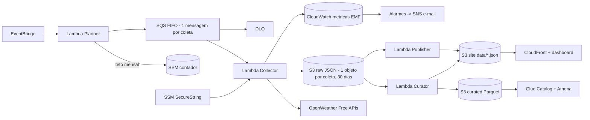

# Weather Data Pipeline

Pipeline que monta uma serie temporal propria de clima e qualidade do ar das 27 capitais do Brasil usando **somente APIs do plano gratuito da OpenWeather**, com tabelas Parquet consultaveis (Athena ou DuckDB) e um **dashboard web**.

O projeto nao compra historico passado: ele coleta continuamente observacoes e previsoes e agrega por hora, dia, semana, mes e ano conforme o tempo passa.

## Dois modos, o mesmo codigo

| | **AWS (serverless)** | **Offline (sua maquina ou Docker)** |
|---|---|---|
| Custo | ~US$ 0,70/mes, coberto pelos creditos do plano Free | US$ 0 de nuvem |
| Disponibilidade | 24/7 sem depender do seu computador | enquanto a maquina/container estiver ligado |
| Dashboard | CloudFront (link publico) | `http://localhost:8000` |
| Consultas | Athena | DuckDB (`scripts/query_local.py`) |
| Comecar | `./scripts/deploy.ps1 ...` | `./scripts/start-offline.ps1` ou `docker compose up -d` |

Os dois usam o mesmo layout de dados: `./scripts/export-from-aws.ps1` traz tudo da AWS para o modo offline (por exemplo, antes de a conta do plano Free fechar no sexto mes). Detalhes: [`docs/offline.md`](docs/offline.md) e [`docs/cost-controls.md`](docs/cost-controls.md).

## O que roda sozinho (AWS ou offline)

| Quando | Quem | O que faz |
|---|---|---|
| a cada 3 min (`CurrentWeatherIntervalMinutes`) | Planner -> SQS -> Collector | Current Weather das 27 capitais |
| minuto 05 de cada hora | Planner -> SQS -> Collector | 5 Day / 3 Hour Forecast |
| minuto 35 de cada hora | Planner -> SQS -> Collector | Air Pollution (atual) |
| 00:50, 06:50, 12:50, 18:50 UTC | Planner -> SQS -> Collector | Air Pollution forecast (4 dias, horario) |
| minuto 20 de cada hora | Curator | tabela horaria, previsoes, agregados diarios, recuperacao de horas perdidas e series do dashboard |
| a cada 10 min | Publisher | `data/latest.json` com a observacao mais recente de cada capital e o consumo do mes |
| sempre | Planner | suspende coletas se o teto mensal de chamadas for atingido |
| sempre | CloudWatch + SNS | alarmes por e-mail (falhas, chave invalida, coleta parada, DLQ, teto mensal) |

Nada disso exige intervencao manual. A chave da API pode ser trocada no SSM sem redeploy.

## Arquitetura



Detalhes em [`docs/architecture.md`](docs/architecture.md).

## APIs usadas e teto operacional

Plano Free da OpenWeather: **60 chamadas/minuto e 1.000.000 chamadas/mes**. O projeto usa no maximo **500.000/mes** (50%), e esse teto e aplicado pela Planner com um contador mensal gratuito (parametro SSM na AWS, arquivo local no modo offline).

| Produto | Endpoint | Cadencia | Chamadas em 31 dias |
|---|---|---|---|
| Current Weather | `/data/2.5/weather` | 3 min | 401.760 |
| 5 Day / 3 Hour Forecast | `/data/2.5/forecast` | 1 h | 20.088 |
| Air Pollution | `/data/2.5/air_pollution` | 1 h | 20.088 |
| Air Pollution forecast | `/data/2.5/air_pollution/forecast` | 6 h | 3.348 |
| **Total** | | | **445.284** (430.920 em 30 dias) |

Cada coleta consulta as 27 capitais em sequencia, uma chamada a cada 1,1 s, e grava **um unico objeto** com as 27 respostas. Os horarios das agendas garantem no maximo duas coletas na mesma janela de 60 segundos (54 < 60). Geocoding nao e usado: as coordenadas ficam em `src/shared/capitals.py`.

Campos aproveitados e limites: [`docs/data-source.md`](docs/data-source.md).

## Comecando

Requisitos: Python 3.13 e PowerShell 7 (ou Windows PowerShell 5.1). Para AWS: AWS CLI, SAM CLI e Docker. Para o modo offline via container: so Docker.

```powershell
python -m venv .venv
.venv\Scripts\Activate.ps1
python -m pip install -r requirements.txt
./scripts/test.ps1 -SkipInstall
```

### 1. Ver o dashboard sem AWS e sem chave

Gera dados sinteticos, passa pelo Curator e pelo Publisher reais e serve o site em `http://localhost:8000`:

```powershell
./scripts/preview-frontend.ps1
```

### 2. Rodar offline, com a API real e sem nuvem

```powershell
Copy-Item .env.example .env   # preencha OPENWEATHER_API_KEY
./scripts/test-openweather-local.ps1 -States SP -Products all   # teste rapido da chave
./scripts/start-offline.ps1                                     # pipeline completo + dashboard em http://localhost:8000
```

Ou, para deixar rodando 24/7: `docker compose up -d`. No Windows, `./scripts/install-offline-service.ps1` inicia o servico sozinho ao fazer logon. Os dados ficam em `.local-data/` e `frontend/data/` (ambos no `.gitignore`). Guia completo: [`docs/offline.md`](docs/offline.md).

### 3. Deploy na AWS (um comando)

```powershell
./scripts/deploy.ps1 `
  -StackName weather-data-pipeline-dev `
  -Environment dev `
  -Region sa-east-1 `
  -BudgetAlertEmail "seu-email@example.com" `
  -EnableSchedules true `
  -RunInitialCollection
```

O script:

1. roda `sam build` e `sam deploy` sem confirmacao interativa (use `-ConfirmChangeset` para revisar);
2. cria o parametro SSM com a chave da OpenWeather se ele nao existir (usa `-ApiKey`, `OPENWEATHER_API_KEY` ou o `.env`);
3. publica o frontend no bucket do site e invalida o CloudFront;
4. com `-RunInitialCollection`, coleta todos os produtos uma vez e publica os dados, para o dashboard nao nascer vazio;
5. mostra os outputs, incluindo `DashboardUrl`.

Confirme a inscricao do e-mail do SNS e do Budget quando a AWS enviar. Para comecar sem agenda, use `-EnableSchedules false` e dispare coletas manuais.

Parametros principais do `template.yaml`:

| Parametro | Padrao | Efeito |
|---|---|---|
| `EnableSchedules` | `false` | liga todas as agendas |
| `CurrentWeatherIntervalMinutes` | `3` | 3, 5, 10, 15 ou 30 |
| `EnableAirPollution` | `true` | coleta Air Pollution atual e previsao |
| `MonthlyOperationalCallLimit` | `500000` | teto aplicado pela Planner |
| `EnableFrontend` | `true` | CloudFront para o dashboard |
| `EnableAnalytics` | `true` | tabelas Glue com partition projection e workgroup Athena |
| `BudgetAlertEmail` | vazio | e-mail do Budget e dos alarmes |
| `RawDataRetentionDays` | `30` | expiracao do raw |
| `LogRetentionDays` | `7` | retencao dos logs |

### Deploy pelo GitHub Actions

`.github/workflows/ci.yml` roda lint, testes, `cfn-lint`, checagem do frontend, uma execucao sintetica ponta a ponta e `sam validate/build` em todo push para `main` e em pull requests.

`.github/workflows/deploy.yml` faz o deploy com OIDC:

1. crie uma role IAM confiavel para `token.actions.githubusercontent.com` restrita a este repositorio e salve o ARN no secret `AWS_DEPLOY_ROLE_ARN`;
2. opcional: secret `OPENWEATHER_API_KEY` (cria o parametro SSM no primeiro deploy), variaveis `AWS_REGION`, `BUDGET_ALERT_EMAIL`, `ENABLE_SCHEDULES`;
3. rode o workflow manualmente, ou defina a variavel `AUTO_DEPLOY=true` para publicar a cada push em `main`.

## Operacao manual (quando quiser)

```powershell
./scripts/invoke-planner.ps1 -Products all                     # coleta agora
./scripts/invoke-planner.ps1 -Products current_weather -States SP,RJ
./scripts/invoke-publisher.ps1                                 # atualiza data/latest.json
./scripts/invoke-curator.ps1                                   # horas faltantes das ultimas 6 h
./scripts/invoke-curator.ps1 -TargetHour "2026-06-25T12:00:00Z"
./scripts/invoke-curator.ps1 -StartHour "2026-06-01T00:00:00Z" -EndHour "2026-06-07T23:00:00Z" -RebuildServing
./scripts/publish-frontend.ps1                                 # apenas o site
./scripts/set-openweather-key.ps1 -Environment dev             # troca a chave (le .env ou pergunta)
```

O backfill so funciona dentro da retencao do raw (`RawDataRetentionDays`). Runbook: [`docs/incident-runbook.md`](docs/incident-runbook.md).

## Dados gerados

```text
raw/source=openweather-free-plan/product=<produto>/year=/month=/day=/hour=/openweather_<produto>_<yyyymmddThhmmZ>_<hash-das-UFs>.json
curated/hourly_observations/year=/month=/day=/hour=/weather_hourly_observations_<yyyymmddThh00Z>.parquet
curated/daily_observations/year=/month=/day=/weather_daily_observations_<yyyymmdd>.parquet
curated/forecast_3h/year=/month=/day=/hour=/weather_forecast_3h_<yyyymmddThh00Z>.parquet
site: data/latest.json, data/hourly/<uf>.json, data/daily/<uf>.json, data/forecast/<uf>.json
```

- **Horaria**: uma linha por capital por hora UTC, com clima (observacoes repetidas contam uma vez) e qualidade do ar.
- **Diaria**: uma linha por capital por **data local** (Acre UTC-5; AM, RO, RR, MT, MS UTC-4; demais UTC-3).
- **Previsao**: as 40 previsoes de 3 h emitidas em cada hora, com antecedencia (`lead_hours`).

Dicionario de colunas: [`docs/data-dictionary.md`](docs/data-dictionary.md). Estrategia de armazenamento: [`docs/storage-strategy.md`](docs/storage-strategy.md).

### Athena

Com `EnableAnalytics=true`, o stack cria o banco `weather_<environment>` com as tabelas `weather_hourly_observations`, `weather_daily_observations` e `weather_forecast_3h` (partition projection, sem crawler) e o workgroup `<StackName>` com limite de 1 GB lido por consulta. Exemplos em [`queries/`](queries/), incluindo erro de previsao por antecedencia.

## Dashboard

Site estatico em `frontend/` (HTML, CSS e JavaScript sem dependencias), com tema claro/escuro e tabelas acessiveis para cada grafico:

- **Visao geral**: destaques, ranking por metrica e regiao, resumo por regiao e cards das 27 capitais.
- **Capital**: condicoes atuais com todos os campos da Current Weather, qualidade do ar comparada as diretrizes da OMS, previsao de 5 dias, previsao de qualidade do ar de 4 dias, ultimas horas e historico agregado por dia, semana, mes ou ano.
- **Comparar**: ate 4 capitais na mesma escala (temperatura, umidade, chuva acumulada, PM2,5).
- **Sobre os dados**: situacao do pipeline e consumo mensal da OpenWeather.

Detalhes em [`docs/frontend.md`](docs/frontend.md).

## Custos

- **AWS**: ~US$ 0,70/mes com a cadencia padrao, quase tudo requisicoes ao S3; Lambda, SQS, CloudWatch, CloudFront, SNS, SSM e Glue ficam dentro das cotas sempre gratuitas. No plano Free (6 meses, ate US$ 200 em creditos) isso sai dos creditos, ~US$ 4 no periodo todo.
- **Atencao**: no fim do plano Free a AWS fecha a conta (90 dias para migrar e recuperar os dados). Rode `./scripts/export-from-aws.ps1` antes e continue no modo offline, ou migre para o plano Paid.
- **Offline**: zero de nuvem.

Detalhes e alavancas em [`docs/cost-controls.md`](docs/cost-controls.md).

## Destruir recursos

```powershell
aws s3 rm s3://<RawDataBucketName> --recursive
aws s3 rm s3://<SiteBucketName> --recursive
sam delete --stack-name weather-data-pipeline-dev --region sa-east-1
aws ssm delete-parameter --name /weather-data-pipeline/dev/openweather-api-key --region sa-east-1
```

## Estrutura

```text
src/planner      agenda uma coleta por produto e aplica o teto mensal
src/collector    consulta as 27 capitais e grava um objeto raw por coleta
src/curator      tabelas Parquet, agregados diarios, catch-up e series do dashboard
src/publisher    data/latest.json
src/shared       capitais, API, observacoes, tabelas, serving, metricas
layers/analytics pyarrow (somente na Curator)
frontend/        dashboard estatico
scripts/         deploy, operacao, modo offline (offline_service.py), consultas DuckDB, exportacao da AWS
Dockerfile       modo offline em container (docker compose up -d)
queries/         consultas Athena
docs/            arquitetura, decisoes, custos, runbook
```
