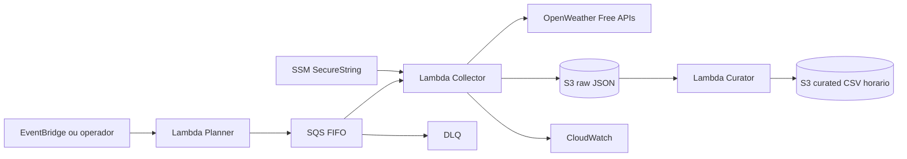

# Weather Data Pipeline

Pipeline serverless AWS para criar uma serie temporal propria de clima das 27 capitais do Brasil usando APIs do plano gratuito da OpenWeather.

Nesta etapa o projeto nao tenta comprar ou reconstruir historico passado. Ele coleta dados atuais e previsoes de forma recorrente, grava snapshots raw no S3 e prepara a base para agregacoes horarias, diarias, semanais, mensais e anuais conforme o tempo passar.

## Arquitetura



## Plano gratuito e teto operacional

O plano gratuito documentado pela OpenWeather para current weather e forecasts permite 60 chamadas/minuto e 1.000.000 chamadas/mes.

Este projeto usa **50% do teto mensal** como limite operacional:

```text
500.000 chamadas/mes
```

Cadencia padrao quando `EnableSchedules=true`:

- Current Weather API: 27 capitais a cada 3 minutos.
- 5 Day / 3 Hour Forecast API: 27 capitais a cada 1 hora.

Estimativa para 30 dias:

```text
current: 27 * 20 * 24 * 30 = 388.800 chamadas/mes
forecast: 27 * 24 * 30 = 19.440 chamadas/mes
total: 408.240 chamadas/mes
```

Isso fica abaixo de 500.000 chamadas/mes e tambem abaixo de 60 chamadas/minuto, desde que a coleta seja mantida pela fila e sem paralelismo agressivo.

## Produtos usados

- Current Weather API: `https://api.openweathermap.org/data/2.5/weather`
- 5 Day / 3 Hour Forecast API: `https://api.openweathermap.org/data/2.5/forecast`
- Geocoding API nao e chamada em producao porque as coordenadas das capitais ficam fixas em `src/shared/capitals.py`.

## Agregacao temporal futura

A camada raw guarda cada snapshot. A etapa seguinte deve normalizar os dados e calcular:

- medias por hora;
- min/max por hora;
- medias diarias;
- acumulado diario de chuva;
- medias semanais e mensais;
- comparativos por capital e regiao.

Para controlar custo e quantidade de objetos, `raw/` expira em 30 dias por padrao. A Lambda Curator consolida snapshots de `current_weather` em uma tabela horaria em `curated/hourly_observations/`. A estrategia completa esta em `docs/storage-strategy.md`.

## Setup local

```powershell
python -m venv .venv
.venv\Scripts\Activate.ps1
python -m pip install -r requirements.txt
./scripts/test.ps1 -SkipInstall
```

## Deploy

```powershell
./scripts/deploy.ps1 `
  -StackName weather-data-pipeline-dev `
  -Environment dev `
  -Region sa-east-1 `
  -MonthlyOperationalCallLimit 500000 `
  -RawDataRetentionDays 30 `
  -LogRetentionDays 7 `
  -MonthlyBudgetAmount 10 `
  -EnableSchedules false
```

Para criar alertas de budget junto com o stack, adicione:

```powershell
-BudgetAlertEmail "seu-email@example.com"
```

## Chave OpenWeather

Para teste local antes do deploy, crie um arquivo `.env` a partir do exemplo:

```powershell
Copy-Item .env.example .env
```

Edite `.env` e preencha:

```text
OPENWEATHER_API_KEY=SUA_API_KEY_AQUI
```

Depois teste a API sem AWS CLI, sem Java e sem deploy:

```powershell
./scripts/test-openweather-local.ps1 -States SP -Products current_weather
./scripts/test-openweather-local.ps1 -States SP,RJ -Products current_weather,forecast_5d_3h
```

O `.env` esta no `.gitignore`; nao faça commit da chave.

Para AWS, a mesma chave deve ir para o SSM Parameter Store:

```powershell
./scripts/set-openweather-key.ps1 -ApiKey "<OPENWEATHER_API_KEY>" -Environment dev -Region sa-east-1
```

Depois de cadastrar ou rotacionar a chave, nao e necessario redeploy.

## Executar coleta manual

```powershell
./scripts/invoke-planner.ps1 -StackName weather-data-pipeline-dev -Region sa-east-1
```

O arquivo `events/planner-event.json` permite testar poucos estados e produtos.

## Gerar tabela horaria manualmente

Depois de coletar dados raw de uma hora, rode a Curator:

```powershell
./scripts/invoke-curator.ps1 `
  -StackName weather-data-pipeline-dev `
  -Region sa-east-1 `
  -TargetHour "2026-06-25T12:00:00Z"
```

A saida tabular fica em CSV com colunas separadas de data, hora, cidade, UF e metricas climaticas:

```text
curated/hourly_observations/year=<yyyy>/month=<mm>/day=<dd>/hour=<hh>/weather_hourly_observations_<timestamp>.csv
```

## Chave S3 raw

```text
raw/source=openweather-free-plan/product=<produto>/year=<yyyy>/month=<mm>/day=<dd>/hour=<hh>/state=<uf>/city=<cidade>/openweather_<produto>_<uf>_<cidade>_<timestamp>.json
```

## Destruir recursos

```powershell
aws s3 rm s3://<RawDataBucketName> --recursive
sam delete --stack-name weather-data-pipeline-dev --region sa-east-1
```
